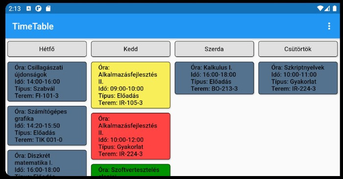

## Desktop Alkalmazás:

### Fő program képernyő:
  - Fő alkalmazás, órarend létrehozás/szerkesztés/nézés
  - Következő óra: piros, elmúlt: sárga, következendő: zöld, más nap: kék, nem fontos: fehér
  - Gyakorlat: Vastag betű, Előadás: Normál betű
  - Órák előtti tálca értesítés
  - Névnapok a főképernyőn
  - Idő alapú éjszakai mód  
    

### Szerkesztés és importálás:
  - Importálni Neptun órarend excel exportból lehet (1 hét exportja)
  - Új óra hozzáadás: Dupla kattintás a napra
  - Óra módosítás/törlés/nem fontossá jelölés: Jobb kattintás az órára
  

### Tálca menü:
  - Alvó mód: Óra előtti értesítések kikapcsolása
  - Importálás: Excelből (Neptun órarend 1 hét exportja vagy kurzus exportja) vagy Json
  - Exportálás: Képbe, Excelbe (Neptun órarend formátumban) vagy Json-ba  
   

### Beállítások menü:
  - Minden szín testreszabható
  - Különféle időpontok/tartamok testreszabhatóak
  - Lehetőség van számítógéppel történő indításra is (háttérben marad a tálcán)  
   

## Telefonos Alkalmazás:
  - Másodlagos alkalmazás, csak nézni lehet az órarendet
  

## Felhő:
  - Órarendeket fellehet tölteni felhőbe
  - Letölteni/szinkronizálni desktopon azonosító alapján, telefonon QR kódból/azonosítóval lehet

## Letöltés, futtatás:
  - 'Releases' Github menüfülből le kell szedni a legújabb telepítőket
  - Desktop: Telepíteni kell az exe fájlt (ne a program files mappába), majd tálcán levő ikonnal futtatni
  - Telefon: Apk fájl telepítés, majd TimeTable alkalmazás futtatás
